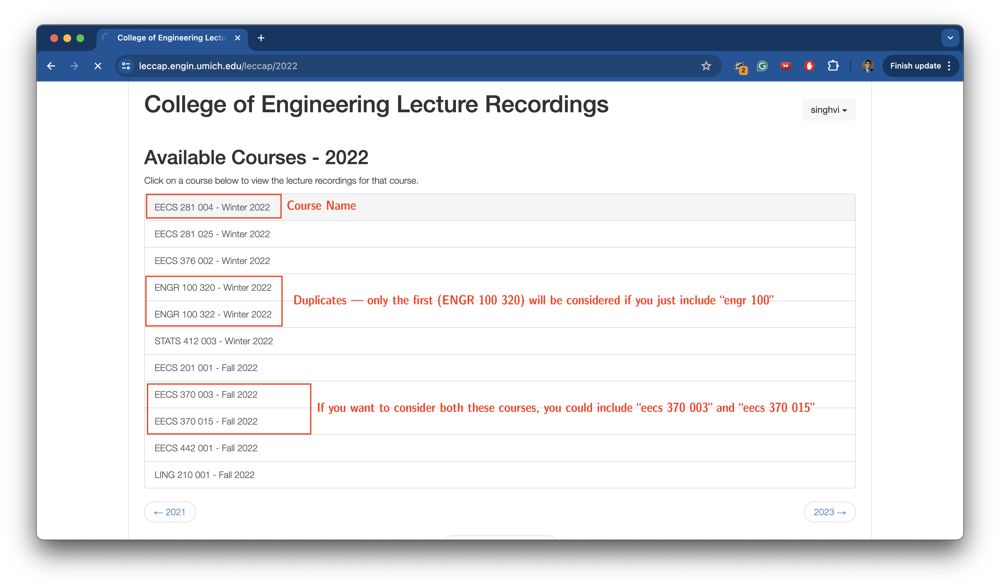
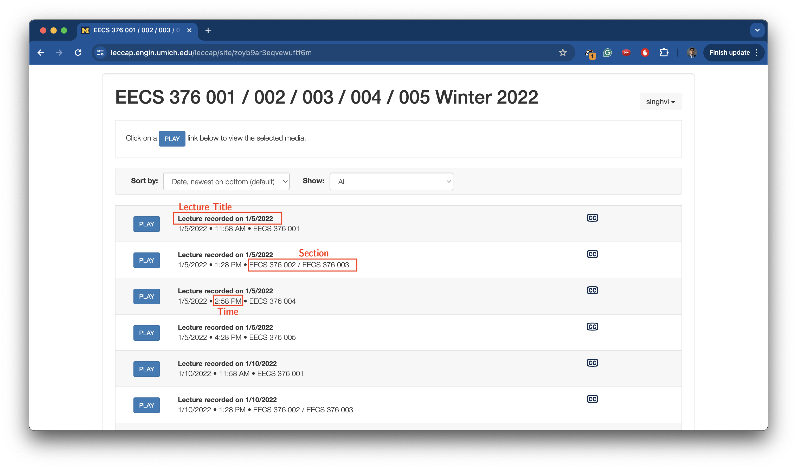

# University of Michigan Lecture Downloads

The scripts included here enable University of Michigan-affiliated individuals to download lectures from the Lecture Capture system ([leccap.engin.umich.edu](https://leccap.engin.umich.edu)). 

As ITS does not make any promises about how long course recordings are retained, downloading content is the best way to ensure that you can access it whenever you want. As of May 2024, course recordings seem to be preserved for at least three years. 

Note that the [CAEN website](https://caen.engin.umich.edu/lecrecording/students/) states that:
> Students who wish to obtain video file downloads of lecture recordings must contact their course instructors directly. Only the instructors of a course may authorize download access.

As such, please contact the instructors of any courses you wish to download before using these scripts. 

## Overview 
The Python script in [`mass-download/`](/mass-download/) enables users to download **any subset** of lectures from **any number of courses**. This script should take no more than five minutes to set up and run (although the actual downloads may take far longer).

Credit goes to [@ajaypillay](https://github.com/ajaypillay) for inspiring this project. A (slightly modified) version of his original script can be found in [`one-off-script/`](/one-off-script/). This script can be run in the browser console and enables users to download all the lectures for a single course.

Note that a single 85-minute lecture video takes about 400 MB to store; please ensure you have enough storage availablle before using these scripts. 

## Usage (Mass Download)
### Python Setup
If you don't have Python installed, you may download it from [here](https://www.python.org/downloads/). 

Navigate to the `mass-download/` directory in your terminal and run
```
$ pip install -r requirements.txt
```
in order to install all necessary packages. You will also need to have Chrome installed. 

### Config Setup
You can configure which courses and lectures to download in `mass-download/config.json`. Please modify this file for your specific coures. The file should be fairly intuitive; I would recommend looking at the example first and then coming back to this section if you are confused.

The `start_year` denotes the first year to begin looking for recordings. 

The `directory_path` signifies where you want your recordings saved. Each course will be a separate folder inside this path. For instance:
```
/Volumes/SSD/lectures   // directory_path
    - eecs280
        - links.txt
        - download_output.txt
        - recording1.mp4
        - recording2.mp4
        - ...
    - eecs281
    - eecs376
    - ...
``` 

The `courses` object has information about which courses you want to scrape. Each course is a separate entry in this dictionary. 
- The name of the course (for instance, `eecs 281`) is searched for in the titles of courses. 
  - Searching for a course name is *not* case-sensitive. 
  - Only the first course found containing a given course name will be scraped; this is the earliest one with the lowest section number. This is because the majority of courses with multiple sections (for instance, a lecture and a discussion) show up as duplicates. 
  - If you want to have multiple courses with the same name considered, you should include a more specific string as the name — for instance, `eecs 477 001 - Fall 2023` and `eecs 477 001 - Winter 2023`. 



- For a given course, you may specify filters to configure which recordings you wish to download. 
  - For instance, you may only want to download the 10:30 AM lectures; or perhaps the Section 001 lectures and the Section 025 Discussions; or maybe you want all of the lectures and the review sessions. All these can be achieved with filters. 
  - There are three filter properties that you can specify for each course: a `title_filter`, a `section_filter`, and a `time_filter`. Each of these properties is an array of strings; you may specify 0, 1, 2, or all 3. 
  - If no filters are specified for a course (or the specified ones are empty), all recordings for that course are downloaded by default. 
  - If some filters are specified, only the recordings that match *any* of the filters will be downloaded (in other words: it's an OR, not an AND). 
  - `title_filter`: A recording matches a `title_filter` if its title includes any of the strings in the `title_filter` array (case-insensitive). 
  - `section_filter`: A recording matches a `section_filter` if its section includes any of the strings in the `section_filter` array (case-insensitive). Note that section numbers are not always specified.
  - `time_filter`: A recording matches a `time_filter` if its start time is within 15 minutes of any of the times in the `time_filter` array. Times are specified in `H:MM AM/PM` format — for instance, `10:30 AM`. 
  


### Running the script
Navigate to the `mass-download/` directory in your terminal and run `$ make`. 

The script will open a browser window to the lecture capture website; once you have logged in, the window will automatically minimize and the script will begin scraping recordings based on your configuration. 


## Usage (One-Off Script)
You simply need to navigate to the course page for which you want to download recordings (second screenshot above), open up the browser console, and run the script. This will prompt you to download a `links.txt` file with links to all recordings. From here, you can use the command 
```
$ xargs < links.txt -P 0 -L 1 wget -O 
```
to download all recordings in `links.txt` simultaneously. 

Note that you can only download one course at a time with this script. In order to filter recordings using this script, you will have to implement your own logic. 


